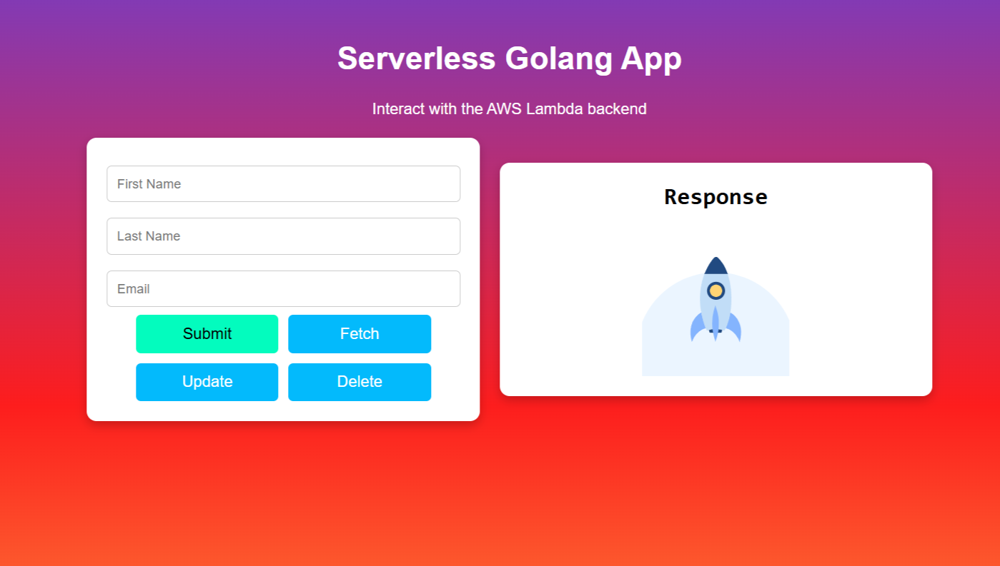

# Serverless with Golang

## 📌 Overview
This project implements a **serverless web application** using **Golang** for the backend and a **modern frontend**. The backend is deployed on **AWS Lambda** with **API Gateway**, while the frontend is hosted on **Vercel**. The application follows a architecture to ensure scalability, cost-efficiency, and high availability.

  

## 🚀 Features
### 🔹 Backend (Golang API)
- **Serverless architecture**: Hosted on AWS Lambda.
- **DynamoDB** for database storage.
- **API Gateway** for secure RESTful API access.
- **Automatic Scaling** based on demand.


### 🔹 Frontend (React + Vercel)
- **Modern UI/UX** with responsive design.
- **API Integration** with AWS Lambda.
- **Deployed on Vercel** for high-speed delivery.

## 🔧 Tech Stack
- **Backend**: Golang, AWS Lambda, API Gateway, DynamoDB
- **Frontend**: React.js, Tailwind CSS, Vercel
- **Infrastructure**: Terraform 

## 🎯 Architecture Diagram


## 📂 Project Structure
```bash
📦 Serverless-with-Golang
 ┣ 📂 backend
 ┃ ┣ 📂 handlers
 ┃ ┣ 📂 models
 ┃ ┣ 📂 services
 ┃ ┣ 📜 main.go
 ┣ 📂 frontend
 ┃ ┣ 📂 src
 ┃ ┣ 📜 index.js
 ┃ ┣ 📜 App.js
 ┣ 📜 README.md
```

## 🔗 Repositories
- **Backend API**: [Serverless-with-Golang](https://github.com/ARUP-G/Serverless-with-Golang)
- **Frontend**: [Serverless-with-Golang-frontend](https://github.com/ARUP-G/Serverless-with-Golang-frontend)

## 🚀 Deployment Guide
### Backend (AWS Lambda)
1. Clone the backend repository
   ```bash
   git clone https://github.com/ARUP-G/Serverless-with-Golang.git
   ```
2. Deploy using intructions given in the 
    [Backend-README.md](https://github.com/ARUP-G/Serverless-with-Golang/blob/main/README.md)
3. Verify API Gateway endpoints

### Frontend (Vercel)
1. Clone the frontend repository
   ```bash
   git clone https://github.com/ARUP-G/Serverless-with-Golang-frontend.git
   ```
2. Install dependencies
   ```bash
   npm install
   ```
3. Deploy on Vercel
   ```bash
   vercel deploy
   ```

## 📌 Usage
- **Access the deployed frontend**: `https://your-vercel-app.vercel.app`
- **API Gateway URL**: `https://your-api-gateway.amazonaws.com/prod/`
- **Authentication**: Use JWT tokens for secure access.

## 🛠️ Contributing
Contributions are welcome! Please submit a PR or open an issue.

## 📜 License
This project is licensed under the **MIT License**.
